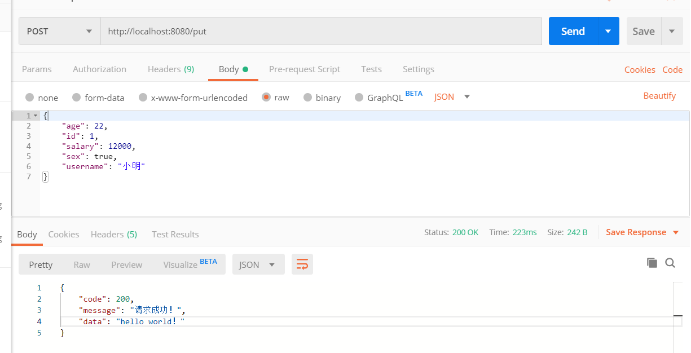
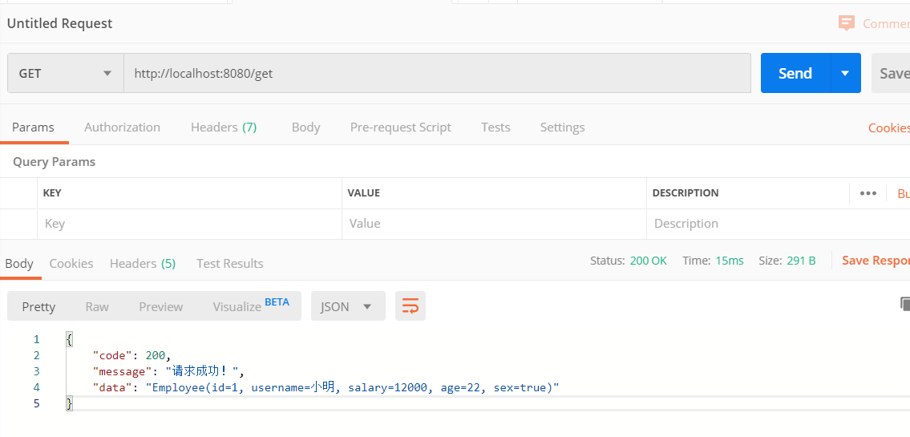
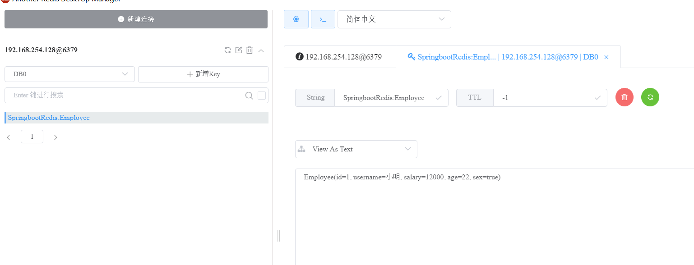

## Redis 实战（1）
概述
> redis相信你看到我这一篇文章和demo之前，相信你对Redis也有大概的认识了，所以本demo以本文代码基于SpringBoot2.0整合Redis自定义注入模板操作Bean组件。

废话不多说，下面我们开始编写相关demo案例。
#### 一
导入相关依赖

```java
        <dependency>
            <groupId>org.springframework.boot</groupId>
            <artifactId>spring-boot-starter-redis</artifactId>
            <version>1.3.3.RELEASE</version>
        </dependency>
```
然后在Springboot项目中的application.application配置相关redis配置，具体请看下面
```xml
#单机配置
spring.redis.host=192.168.254.128
spring.redis.port=6379
#Redis密码
# spring.redis.password=
#redis ；连接池最小的连接数量
spring.redis.jedis.pool.min-idle=100
#redis ；连接池最大可用数量
spring.redis.jedis.pool.max-idle=300
#redis : 连接池最大活跃数量
spring.redis.jedis.pool.max-active=500

#集群配置
#spring.redis.cluster.nodes=192.168.254.128:6379,192.168.254.128:6380,192.168.254.128:6381,192.168.254.128:6382
```
### 二
我们开始配置相关Redis组件,主要是RedisTemplate和StringTemplate
在叙述SpringBoot提供组件之前，我们有必要聊聊传统的 SSM框架中集成Redis我们是怎么操作，
当然也有提供一个jedis组件，通过jedis封装出RedisUtils工具类来接入项目，这样导致，我们需要手动去关闭连接和创建连接，显得比较麻烦，也有可能会浪费资源。
讲完上面传统我们来说下SpringBoot中集成Redis，当然SpringBoot推崇的是约定编程，，“约定优先于配置”，”起步依赖“ 等等优点。好处就是帮我们省去了传统项目的麻烦，
具体SpringBoot更直接的封装，就是我们马上要讲的组件，RedisTemplate和StringTemplate。具体请看下面代码。
主要是配置相关序列化策略
```java
package com.jakclinsir.redis.config;

import org.springframework.beans.factory.annotation.Autowired;
import org.springframework.cache.annotation.EnableCaching;
import org.springframework.context.annotation.Bean;
import org.springframework.context.annotation.Configuration;
import org.springframework.data.redis.connection.RedisConnectionFactory;
import org.springframework.data.redis.core.RedisTemplate;
import org.springframework.data.redis.core.StringRedisTemplate;
import org.springframework.data.redis.serializer.GenericJackson2JsonRedisSerializer;
import org.springframework.data.redis.serializer.StringRedisSerializer;


/**
 * @author linSir
 * @EnableCaching 开启缓存注解
 */
@EnableCaching
@Configuration
public class RedisConfig {

    @Autowired
    private RedisConnectionFactory connectionFactory;


    /**
     * RedisTemplate组件
     *
     * @return
     */
    @Bean
    public RedisTemplate redisTemplate() {
        RedisTemplate<String, Object> redisTemplate = new RedisTemplate<>();
        //设置Redis连接工厂
        redisTemplate.setConnectionFactory(connectionFactory);
        //设置Redis序列化策略
        redisTemplate.setKeySerializer(new StringRedisSerializer());
        redisTemplate.setValueSerializer(new GenericJackson2JsonRedisSerializer());
        redisTemplate.setHashKeySerializer(new StringRedisSerializer());
        redisTemplate.afterPropertiesSet();
        return redisTemplate;
    }

    /**
     * StringRedisTemplate组件
     *
     * @return
     */
    @Bean
    public StringRedisTemplate stringRedisTemplate() {
        StringRedisTemplate redisTemplate = new StringRedisTemplate();
        //设置连接工厂
        redisTemplate.setConnectionFactory(connectionFactory);
        //设置序列化策略
        return redisTemplate;
    }

}

```
### 三
我们编写一个controller试试来操作先Redis
```java
package com.jakclinsir.redis.controller;

import com.jakclinsir.redis.po.Employee;
import com.jakclinsir.redis.result.CommonResult;
import lombok.extern.slf4j.Slf4j;
import org.springframework.beans.factory.annotation.Autowired;
import org.springframework.data.redis.core.StringRedisTemplate;
import org.springframework.web.bind.annotation.GetMapping;
import org.springframework.web.bind.annotation.PostMapping;
import org.springframework.web.bind.annotation.RequestBody;
import org.springframework.web.bind.annotation.RestController;

/**
 * @author linSir
 * @version V1.0
 * @Date 2020/1/18 20:34
 */
@Slf4j
@RestController
public class RedisController {

    @Autowired
    private StringRedisTemplate redisTemplate;
    public static final String reidsKey = "SpringbootRedis:Employee";

    @PostMapping("/put")
    public CommonResult redisPut(@RequestBody Employee employee) {
        try {
            if (employee != null) {
                //保存进入Redis
                redisTemplate.opsForValue().set(reidsKey, employee.toString());
                return CommonResult.success("hello world！");
            }
        } catch (Exception e) {
            e.printStackTrace();
            log.info("保存数据进去Redis发生异常: {}", e.getMessage());
        }
        return CommonResult.filed();
    }

    @GetMapping("/get")
    public CommonResult redisGet() {
        try {
            return CommonResult.success(redisTemplate.opsForValue().get(reidsKey));
        } catch (Exception e) {
            e.printStackTrace();
            log.info("获取redis数据发生异常了: {}", e.getMessage());
        }
        return CommonResult.filed();
    }
}
```
### 四
测试结果

put：



get:


redis客户端：


* [源码地址](https://github.com/Jacklinsir/Redis-ApplicationScene/tree/master/redsis-hello-01)